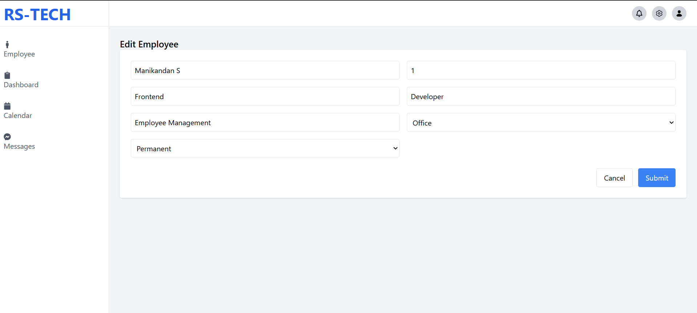

# 🧑‍💻 Employee Management System

## 📌 Project Overview

This project is a full-stack Employee Management System built using **React (Vite), Node.js, Express, and MySQL**.

The application allows users to:

* Add employees
* View employee details
* Edit employee information
* Delete employees

The UI is designed based on the provided Figma design and aims to closely match the layout and user experience.

---

## 🚀 Tech Stack

### Frontend

* React (Vite)
* Tailwind CSS
* Axios
* React Router DOM

### Backend

* Node.js
* Express.js
* MySQL
* dotenv

---

## 📁 Project Structure

```
employeeManagement-RS/
│
├── frontend/
│   ├── components/
│   ├── pages/
│   ├── services/
│
├── backend/
│   ├── controllers/
│   ├── routes/
│   ├── database/
│   └── server.js
```

---

## 🛠️ Features

* Clean UI matching Figma design
* Full CRUD operations
* Modular folder structure
* API integration using Axios
* Backend with RESTful APIs
* MySQL database integration

---

## 📅 Development Journey

### Day 1

* Project setup (frontend + backend)
* Folder structure created
* Installed dependencies (React, Express, Axios)

### Day 2

* UI development started
* Sidebar and Navbar implemented
* Basic pages created

### Day 3

* Employee form and table UI completed
* Routing setup using React Router

### Day 4

* API integration started
* Backend structure (routes, controllers, DB connection)

### Day 5

* Debugging API issues
* Fixed connection errors and routing mistakes
* Improved UI alignment with Figma

### Day 6

* Full integration (frontend + backend)
* CRUD operations working
* Final UI polishing

---

## ⚙️ Setup Instructions

### 1. Clone Repository

```
git clone https://github.com/manikandan-dev7/employee-management-system.git
```

---

### 2. Backend Setup

```
cd backend
npm install
npm run dev
```

---

### 3. Frontend Setup

```
cd frontend
npm install
npm run dev
```

---

### 4. Database Setup (MySQL)

```sql
CREATE DATABASE employee_db;

USE employee_db;

CREATE TABLE employees (
  id INT AUTO_INCREMENT PRIMARY KEY,
  name VARCHAR(100),
  employeeId VARCHAR(50),
  department VARCHAR(100),
  designation VARCHAR(100),
  project VARCHAR(100),
  type VARCHAR(50),
  status VARCHAR(50)
);
```

---

## ⚠️ Challenges Faced

* Backend connection issues (ERR_CONNECTION_REFUSED)
* API route mismatches
* Handling async API calls properly
* Debugging frontend-backend integration
* Setting up MySQL and environment variables

These challenges helped in understanding **real-world debugging and problem-solving**.

---

## 📷 Screenshot

### Dashboard


### Edit Employee Page


### View Employee Page


### Delete Employee Page


---

## 💡 Learnings

* How frontend and backend communicate in real applications
* Importance of correct API structure
* Debugging real-time errors
* Working with environment variables securely
* Writing clean and structured code

---

## 🙌 Experience & Feedback

This assignment was a really valuable opportunity to work on a **real-time full-stack project**.

It helped me:

* Understand practical development workflows
* Face real-world issues and debug them
* Improve my problem-solving skills

I genuinely enjoyed building this project and learning throughout the process.

---

## 🎯 Final Thoughts

This project gave me a strong foundation in full-stack development.
I would be excited to be a part of your team and continue learning and contributing.

---

## 📬 Author

**Manikandan**
GitHub: manikandan-dev7

---
